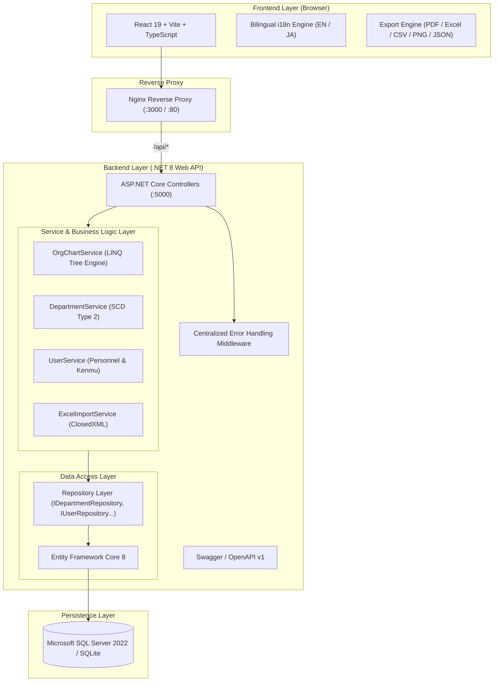

# Organizational Visualization Platform (組織図自動出力プラットフォーム)

An enterprise web application designed to automatically generate, visualize, compare, and manage organizational hierarchy and personnel structures from Excel datasets. Re-architected with a production-grade **C# / .NET 8, ASP.NET Core Web API, Entity Framework Core, SQL Server** backend while preserving the rich, interactive **React 19 + TypeScript + Vite** frontend.

---

## 📸 Screenshots & Visual Demonstrations

### 1. Interactive Org Chart View


### 2. Side-by-Side Version & Timeline Comparison


### 3. Employee & Department Management


### 4. Excel Data Upload & Import


---

## 🌟 Key Features

* 📊 **Hierarchical Tree Reconstruction**: Real-time tree construction with parent-child relationships, executive leadership sorting, and dual-role (*兼務 - Kenmu*) visualization.
* ⏳ **SCD Type 2 Timeline & History**: Slowly Changing Dimensions (Type 2) tracking for departments and employees with `valid_from` and `valid_to` timestamps.
* 🔄 **Side-by-Side Snapshot Comparison**: Compare current structure against past organizational snapshots or compare any two points in history.
* 📁 **Automated Excel Ingestion**: High-performance Excel parsing and column structure validation powered by `ClosedXML`.
* 👥 **Personnel Management**: Search, filter, bulk deactivation, department re-parenting, and title hierarchy management.
* 📜 **Audit History Logging**: Full audit trail recording all structural and metadata modifications.
* 📄 **Multi-Format Exporting**: Export visual charts to PDF (F4/A4 multi-page), Excel (`.xlsx`), CSV (UTF-8 BOM), PNG, and JSON.
* 🌐 **Bilingual Support (i18n)**: Seamless instant switching between Japanese (日本語) and English.

---

## 🛠️ Tech Stack

### Backend
* **Language & Runtime:** C# / .NET 8 SDK
* **Framework:** ASP.NET Core Web API
* **ORM & Querying:** Entity Framework Core 8, LINQ
* **Database:** Microsoft SQL Server 2022 (with local SQLite developer profile)
* **Spreadsheet Processing:** ClosedXML
* **Validation:** FluentValidation
* **Documentation:** Swagger / OpenAPI
* **Testing:** xUnit, Moq, FluentAssertions, `Microsoft.AspNetCore.Mvc.Testing`

### Frontend
* **Framework:** React 19 + TypeScript
* **Build Tool:** Vite
* **Styling:** Tailwind CSS
* **Icons:** Lucide React
* **Export Utilities:** jsPDF, html2canvas, xlsx, DOMPurify

### Infrastructure & DevOps
* **Containerization:** Docker & Multi-stage Dockerfiles
* **Orchestration:** Docker Compose
* **Web Server:** Nginx (SPA routing + reverse proxy)
* **CI/CD:** GitHub Actions

---

## 🏛️ System Architecture



---

## 🚀 Running Locally

### Prerequisites
* [.NET 8 SDK](https://dotnet.microsoft.com/download/dotnet/8.0)
* [Node.js 20+](https://nodejs.org/) and npm
* [Docker & Docker Compose](https://www.docker.com/) (optional for containerized setup)

---

### Option 1: Docker Compose (Recommended)

To build and launch the complete stack (SQL Server + ASP.NET Core API + React Frontend):

```bash
docker compose up --build
```

Access the services:
* **Frontend Application:** [http://localhost:3000](http://localhost:3000)
* **Backend API / Swagger UI:** [http://localhost:5000/swagger](http://localhost:5000/swagger)
* **API Health Check:** [http://localhost:5000/api/health](http://localhost:5000/api/health)

---

### Option 2: Local Development Mode

#### 1. Start the Backend (.NET 8 API)
```bash
cd backend
dotnet restore OrgChart.sln
dotnet run --project src/OrgChart.Api/OrgChart.Api.csproj --launch-profile Development
```
*The API will start on `http://localhost:5000` with the development SQLite provider and auto-seed the baseline dataset from `seed/`.*

#### 2. Start the Frontend (React / Vite)
```bash
cd frontend
npm install
npm run dev
```
*Access the development UI at `http://localhost:5173`.*

---

## 🧪 Running Tests

Execute the automated test suite (Service unit tests, FluentValidation tests, and ASP.NET Core integration tests):

```bash
dotnet test backend/OrgChart.sln --logger "console;verbosity=normal"
```

---

## 📡 API Endpoint Summary

| Method | Endpoint | Description |
| :--- | :--- | :--- |
| `GET` | `/api/health` | Service health status check |
| `GET` | `/api/orgchart` | Reconstruct hierarchical org tree for any date (`?date=YYYY-MM-DD`) |
| `GET` | `/api/departments` | List departments (`?date=YYYY-MM-DD`) |
| `GET` | `/api/departments/tree` | Hierarchical department tree (`?date=YYYY-MM-DD`) |
| `GET` | `/api/departments/{id}` | Get department details by ID |
| `POST` | `/api/departments` | Create new department |
| `PUT` | `/api/departments/{id}` | Update department metadata (creates SCD Type 2 version) |
| `DELETE` | `/api/departments/{id}` | Retire department and re-parent children to root |
| `GET` | `/api/users` | List employees with filters (`?date=...&department_id=...&title=...&active=...`) |
| `GET` | `/api/users/{id}` | Get employee profile by ID |
| `POST` | `/api/users` | Create new employee record |
| `PUT` | `/api/users/{id}` | Update employee profile (creates SCD Type 2 version) |
| `DELETE` | `/api/users` | Bulk deactivate/terminate employees |
| `DELETE` | `/api/users/{id}` | Deactivate/terminate employee |
| `GET` | `/api/users/{id}/concurrent-duties` | Get dual role (*兼務*) assignments for user |
| `POST` | `/api/users/{id}/concurrent-duties` | Assign concurrent duty (*兼務*) to user |
| `DELETE` | `/api/users/{id}/concurrent-duties/{dutyId}` | Remove concurrent duty assignment |
| `GET` | `/api/history` | Audit log entries (`?table_name=...&record_id=...`) |
| `GET` | `/api/upload/status` | Dataset records count status |
| `POST` | `/api/upload` | Upload and replace dataset from Excel files |

---

## 📄 License
This project is open-source under the MIT License.
